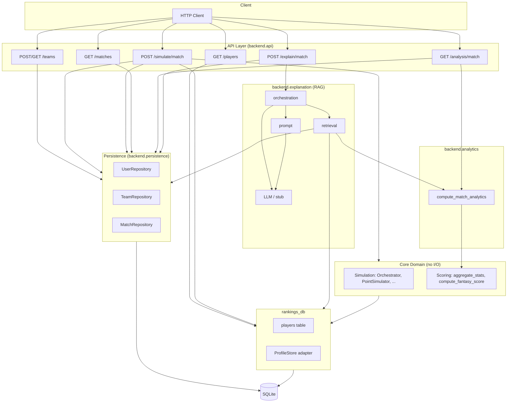
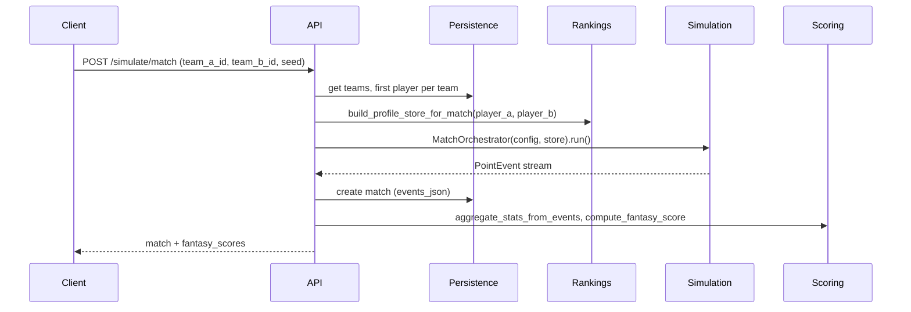
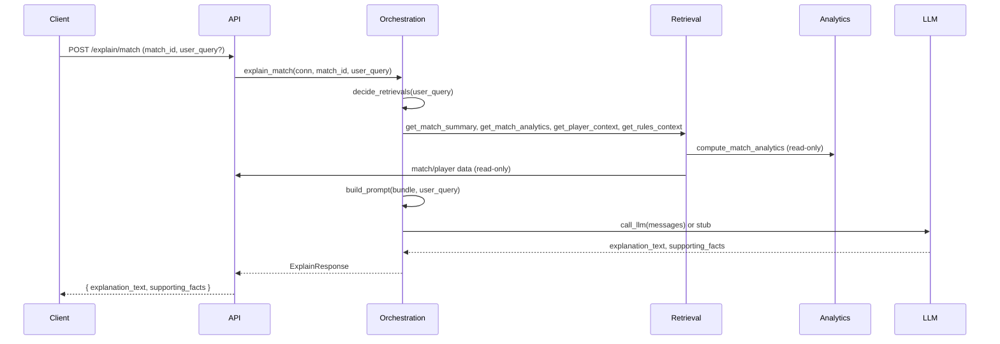

# Table Tennis Fantasy — Codebase Overview

High-level, comprehensive overview of the project: architecture, features, and commit history.

---

## 1. Project Summary

**Table Tennis Fantasy** is a full-stack table tennis fantasy and match-simulation web app. It provides:

- **Deterministic match simulation** — point-by-point table tennis matches with configurable seed for replay.
- **Fantasy scoring** — rubric-based scoring from match events (sets, point differential, clutch, style).
- **REST API** — players, teams, match simulation (single and team-vs-team), match retrieval, analytics, and LLM-based explanations.
- **Phase 2 auth** — hashed passwords (pbkdf2_sha256), JWT; no OAuth. Passwords never stored in plain text.
- **Phase 2 team creation** — roster of 10 (7 active, 3 bench), one captain for bonus scoring, budget constraint (default 1000). Player salaries are computed from rank and ITTF points (dynamic pricing), not a fixed step per rank.
- **Team match simulation** — 7v7 head-to-head with captain bonus; results and highlights per slot; team_matches table and TeamMatchRepository.
- **SQLite persistence** — users, teams, team_players, matches, team_matches (with serialized events where applicable).
- **Frontend** — Home page (landing, links, LLM copy), Create Team (Phase 2), Simulate Match, Login/Signup, Team Summary; same palette (dark theme, lime primary, amber secondary).
- **Read-only LLM explanations** — agentic RAG pipeline that explains match outcomes using analytics and match data only; no simulation or persistence writes.

**Invariants:** Simulation and scoring are pure, deterministic, and have no DB/API/AI dependencies. The LLM layer sits above analytics and never influences simulation, scoring, or core tables.

---

## 2. System Architecture

### 2.1 Layer Diagram (Mermaid)



### 2.2 Dependency Direction (Text)

```
API → rankings_db, persistence, analytics, explanation, scoring, simulation (schemas, orchestrator, event_to_dict)
explanation → analytics, persistence (read), rankings_db (read)
analytics → scoring, models (Match)
Persistence → models (only)
rankings_db → simulation.profiles (ProfileStore adapter)
Simulation → (no external deps)
Scoring → (no external deps)
```

**Rule:** Simulation and scoring have zero inbound dependencies from infrastructure. The LLM explanation layer only reads; it never writes to core tables or calls simulation/scoring.

### 2.3 Data Flow: Match Simulation



### 2.4 Data Flow: LLM Explanation (RAG)



---

## 3. Directory Structure

```
Table-Tennis-Fantasy-1/
├── backend/
│   ├── api.py                 # FastAPI app, all HTTP endpoints (incl. signup, login, simulate/team-match)
│   ├── auth.py                # Phase 2: password hashing (pbkdf2_sha256), JWT create/decode
│   ├── analytics.py            # Deterministic match analytics (no LLM)
│   ├── models.py               # User, Team, TeamPlayer, TeamMatch, Match (dataclasses)
│   ├── rankings_db.py          # Players table + ProfileStore; salary from rank+points (50–180)
│   ├── scoring.py              # Fantasy scoring (aggregate_stats, compute_fantasy_score)
│   ├── run_live_match.py       # CLI/script for running a match
│   ├── persistence/
│   │   ├── db.py               # get_connection, init_db, set_db_path, Phase 2 migrations
│   │   ├── schema.py           # DDL (users, teams, team_players, matches, team_matches)
│   │   └── repositories.py     # UserRepository, TeamRepository, MatchRepository, TeamMatchRepository
│   ├── simulation/            # Core simulation (deterministic, no I/O)
│   │   ├── orchestrator.py     # MatchOrchestrator, sets_to_win_match
│   │   ├── point_simulator.py  # Point outcome sampling
│   │   ├── probability_engine.py
│   │   ├── profiles.py         # PlayerProfile, ProfileStore
│   │   ├── schemas.py          # MatchConfig, PointEvent, etc.
│   │   ├── persistence.py     # event_to_dict (simulation → JSON)
│   │   ├── state_tracker.py, fatigue_model.py, emitter.py, rng.py
│   ├── explanation/           # Read-only LLM RAG pipeline
│   │   ├── retrieval.py       # get_match_analytics, get_match_summary, get_player_context, get_rules_context
│   │   ├── orchestration.py   # decide_retrievals, gather_context, explain_match
│   │   ├── prompt.py          # build_prompt (grounded instructions)
│   │   ├── llm.py             # call_llm (OpenAI or stub)
│   │   └── schemas.py         # ContextBundle, ExplainResponse
│   └── tests/
│       ├── test_api.py        # API integration tests
│       ├── test_scoring.py
│       ├── test_simulation.py
│       ├── test_simulation_validation.py
│       └── test_live_match.py
├── data/
│   └── rankings.json          # Men's/women's singles rankings (seed data)
├── docs/
│   ├── BACKEND_DESIGN.md      # Data models, API, vertical slice
│   ├── CONTRACTS.md           # Layer contracts, AI boundaries
│   └── CODEBASE_OVERVIEW.md  # This file
├── frontend/                   # React (Vite) SPA
│   ├── src/
│   │   ├── App.tsx             # Routes: Home, Create Team, Create Team Phase 2, Simulate, Login, Signup, Team Summary
│   │   ├── api.ts              # Centralized API client; auth in localStorage; apiRequest with Bearer token
│   │   └── pages/              # Home, CreateTeam, CreateTeamPhase2, SimulateMatch, Login, Signup, TeamSummary
│   └── package.json
├── scripts/
│   ├── vertical_slice.py      # Create teams → simulate → persist → retrieve
│   └── try_explain.py         # API script: create match, GET analytics, POST explain
├── requirements.txt
└── .gitignore
```

---

## 4. Feature Summaries

### 4.1 Core Simulation (`backend.simulation`)

- **Purpose:** Point-by-point table tennis match simulation with deterministic replay.
- **Key components:** `MatchOrchestrator`, `PointSimulator`, `ProbabilityEngine`, `StateTracker`, `FatigueModel`, `Emitter`, `profiles` (PlayerProfile, ProfileStore), `rng` (SeededRNG).
- **Inputs:** `MatchConfig` (match_id, player_a_id, player_b_id, seed, best_of), `ProfileStore` for both players.
- **Output:** Iterator of `PointEvent` (score_before/after, set_scores, outcome.winner_id, shot_type, rally_length, streak_broken, etc.).
- **Invariant:** Same (player_a_id, player_b_id, seed) ⇒ same event sequence; no I/O.

### 4.2 Fantasy Scoring (`backend.scoring`)

- **Purpose:** Compute fantasy points from match events per a fixed rubric.
- **Key functions:** `aggregate_stats_from_events(events, winner_id, player_a_id, player_b_id, best_of)` → `(MatchStats, MatchStats)`; `compute_fantasy_score(stats)` → float.
- **Rubric:** Match win/loss, set wins/losses, sweep/five-set bonuses, net point differential, comeback sets, deciding set, streak break/3+ streaks, forehand/backhand/service winners, unforced errors, risk modifiers.
- **Invariant:** Pure functions; no side effects; events can be PointEvent or dicts with same shape.

### 4.3 Persistence (`backend.persistence`)

- **Purpose:** SQLite CRUD for users, teams, team_players, matches, team_matches.
- **Repositories:** UserRepository (create, get, list_all), TeamRepository (create, get, get_players, list_by_user), MatchRepository (create, get, list_recent), TeamMatchRepository (create, get).
- **Schema:** users (username, password_hash in Phase 2), teams (budget), team_players (slot, is_captain), matches, team_matches (team_a_id, team_b_id, score_a, score_b, captain_a_id, captain_b_id).
- **Migrations:** Phase 2 migrations in db.py add username/password_hash to users, budget to teams, slot/is_captain to team_players, salary to players (backfill from rank when column added).
- **Invariant:** No business logic; repositories accept `conn` and perform only DB operations.

### 4.4 Rankings DB & Profile Adapter (`backend.rankings_db`)

- **Purpose:** Load players from `data/rankings.json` into `players` table; build `ProfileStore` for simulation (PlayerProfile per player).
- **Salary (Phase 2):** `_salary_from_rank_and_points(rank, points)` — dynamic pricing from ITTF rank and points (range 50–180). Used in load_rankings_into_db and as fallback when salary column is missing in get_player / list_players_by_gender.
- **Key functions:** `get_player(conn, player_id)`, `list_players_by_gender(conn, gender, limit)`, `build_profile_store_for_match(conn, player_a_id, player_b_id)`.
- **Invariant:** ProfileStore is consumed only by MatchOrchestrator; no persistence logic inside simulation.

### 4.5 API Layer (`backend.api`)

- **Endpoints:**
  - `POST /signup`, `POST /login` — Phase 2 auth; return user_id, username, token (JWT).
  - `GET /players` — list players (optional gender, limit); includes salary.
  - `POST /teams` — create team. Legacy: user_id, name, gender, player_ids. Phase 2: name, gender, budget, roster (player_id, slot, is_captain); optional user_id for tests; JWT for logged-in user.
  - `GET /teams/{id}` — get team with players/roster.
  - `GET /teams?user_id=...` — list teams for user.
  - `POST /simulate/match` — simulate single match between two teams (first player per team), persist, return match + fantasy_scores.
  - `POST /simulate/team-match` — Phase 2: 7v7 team match (7 active slots, captain bonus), persist team_match and individual matches, return score_a, score_b, highlights, match_ids.
  - `GET /matches/{id}` — get match by ID (includes events if stored).
  - `GET /analysis/match/{id}` — deterministic analytics (outcome, player stats, fantasy_scores); no LLM.
  - `POST /explain/match` — LLM explanation (match_id, optional user_query) → explanation_text, supporting_facts; stub if no OPENAI_API_KEY.
- **Lifespan:** DB init on startup (lifespan context manager).

### 4.6 Deterministic Analytics (`backend.analytics`)

- **Purpose:** Produce structured analytics from a match and its events for API and RAG.
- **Key function:** `compute_match_analytics(match, events)` → dict (match_id, outcome, player_a_stats, player_b_stats, fantasy_scores, total_points_played).
- **Uses:** `aggregate_stats_from_events`, `compute_fantasy_score` (read-only from scoring).
- **Invariant:** Pure function; no I/O; used by GET /analysis/match and by explanation retrieval.

### 4.7 LLM Explanation (`backend.explanation`)

- **Purpose:** Read-only natural-language explanation of match outcomes via an agentic RAG pipeline.
- **Pipeline:** Interpret user_query → decide retrievals → fetch match_summary, match_analytics, player_context, rules_context → build prompt → call LLM (or stub) → return explanation_text + supporting_facts.
- **Retrieval:** `get_match_analytics`, `get_match_summary`, `get_player_context`, `get_rules_context` (all read-only, no simulation/writes).
- **LLM config:** `OPENAI_API_KEY`; if unset or `openai` missing, returns stub (200) so endpoint works without 503.
- **Invariant:** No simulation/scoring calls; no writes to core tables; output is advisory; all claims traceable to retrieved context.

---

## 5. Commit History (Summaries)

| Commit    | Summary |
|----------|--------|
| `090e500` | **first commit** — Initial project setup. |
| `f8ed626` | **Add AI Match Simulation Engine** — backend/simulation: profiles, probability engine, point simulator, state tracker, fatigue model, orchestrator, emitter, persistence; deterministic replay via seeded RNG; test suite in test_simulation.py (31 tests); pytest in requirements. |
| `e381d7f` | **Merge PR #1 (feature/simulation-engine)** — Bring simulation engine into main. |
| `afd1d86` | **Add fantasy scoring test suite and scoring.py cleanup** — Scoring tests and scoring module cleanup. |
| `13e7d03` | **Merge main** — Sync with remote main. |
| `be0e7eb` | **Refactor scoring.py and enhance fantasy scoring tests** — Improved structure/readability in scoring; additional test cases for coverage. |
| `2d0fd78` | **Update rally length statistics** — rankings_db and PlayerProfile: default rally distribution 56% short, 34% medium, 10% long; comments on data source. |
| `edc8e31` | **Add FastAPI and related dependencies** — FastAPI, Uvicorn, HTTPX in requirements.txt. |
| `80a6a85` | **Enhance FastAPI lifespan and test dependencies** — Async lifespan for DB init; TestClient import conditional on HTTPX; test DB path fix. |
| `2ad64f8` | **Refactor type hints in rankings_db.py** — Direct types for build_profile_from_row and build_profile_store_for_match; TYPE_CHECKING for PlayerProfile/ProfileStore. |

**Note:** The following are implemented in the current codebase but may not appear as separate commits in the history above (e.g. added in a feature branch or uncommitted): persistence layer (schema, repositories, db), API endpoints for teams/matches/simulate, GET /analysis/match, POST /explain/match, backend.analytics, backend.explanation (RAG pipeline, stub LLM), scripts/vertical_slice.py, scripts/try_explain.py, docs/CONTRACTS.md and BACKEND_DESIGN.md updates.

---

## 6. Key Invariants & Boundaries

- **Simulation & scoring:** No imports of persistence, rankings_db, or API; receive data via arguments; deterministic and pure.
- **Persistence:** CRUD only; no business logic; repositories take `conn` and use parameterized SQL.
- **Explanation (AI):** Reads only (match/analytics/players/rules); never calls simulation or scoring; never writes to core tables; LLM output is advisory; stub when no API key.

### 6.1 Phase 2 Design Choices

- **Auth:** pbkdf2_sha256 (no bcrypt) to avoid backend init issues; JWT with sub = user id; no OAuth.
- **Roster:** 10 slots (1–7 active, 8–10 bench); exactly one captain in slots 1–7; captain bonus applied in team match scoring.
- **Budget:** Default 1000 in UI; total roster salary must not exceed budget. Salary computed from rank and ITTF points (50–180), not a fixed step per rank.
- **Frontend:** Home at `/` with links to Create Team and Simulate Match; same palette (dark bg, lime primary, amber secondary); auth token in localStorage; API client sends Bearer token when present.

---

## 7. How to Run

- **API:** From project root: `uvicorn backend.api:app --reload --port 8000`. OpenAPI: http://127.0.0.1:8000/docs
- **Vertical slice (no server):** `python3 scripts/vertical_slice.py`
- **Try explanation (server must be running):** `python3 scripts/try_explain.py` (set `OPENAI_API_KEY` in the server environment for real LLM; otherwise stub).
- **Tests:** `pytest backend/tests/` (optional: `--ignore=backend/tests/test_simulation_validation.py` for faster runs).

For more detail on contracts and API shapes, see [CONTRACTS.md](CONTRACTS.md) and [BACKEND_DESIGN.md](BACKEND_DESIGN.md).
